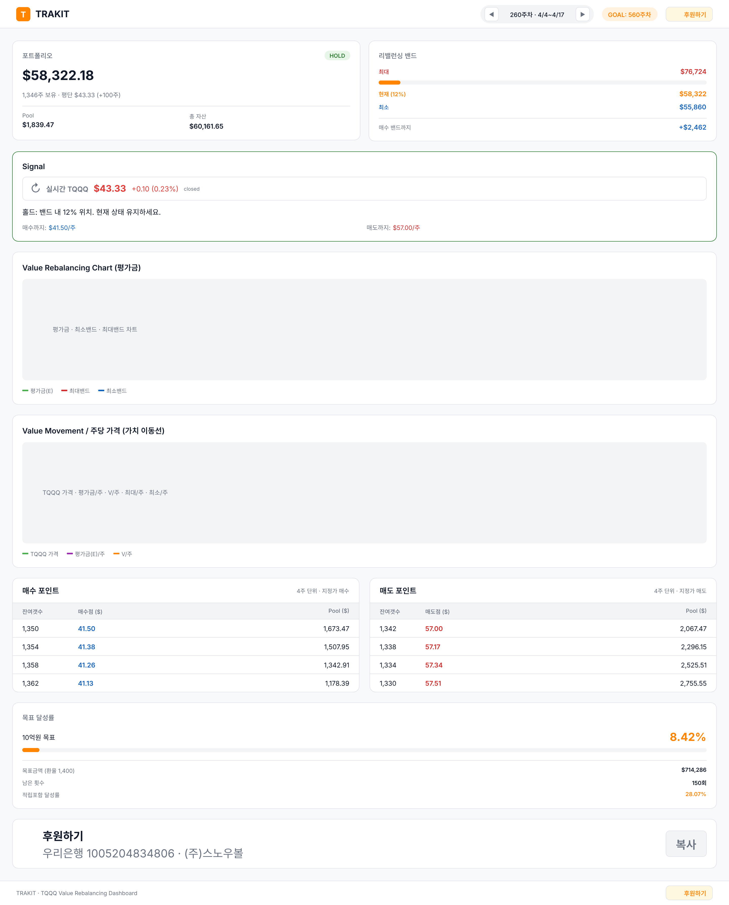

# Trakit - TQQQ Value Rebalancing Dashboard

TQQQ 밸류 리밸런싱 투자 추적 대시보드. Google Sheets 데이터를 기반으로 포트폴리오 상태, 매매 시그널, 매수/매도 포인트를 실시간 추적합니다.



## 프로젝트 구조

```
trakit/
├── backend/          # FastAPI 백엔드 (Python)
├── frontend/         # React 프론트엔드 (Vite + JSX)
├── data/             # 로컬 CSV/TSV 데이터 (fallback)
├── agents/           # 에이전트별 상세 문서
│   ├── backend.md    # 백엔드 에이전트
│   ├── frontend.md   # 프론트엔드 에이전트
│   ├── cicd.md       # CI/CD 에이전트
│   └── pencil.md     # 디자인 에이전트
├── docs/
│   └── api-spec.md   # API 상세 명세
└── start.sh          # 동시 실행 스크립트
```

## 실행 방법

### 로컬 개발

```bash
./start.sh
# 대시보드: http://localhost:5173
# API 문서: http://localhost:8000/docs
```

### Docker 배포

```bash
docker compose up --build -d
# 대시보드: http://localhost
# API: http://localhost:8000
```

## API 라우팅

프론트엔드는 항상 `/api` 상대경로로 API를 호출합니다. 환경별 프록시가 백엔드로 라우팅합니다.

| 환경 | 프론트엔드 | 프록시 | 백엔드 | 설정 파일 |
|------|-----------|--------|--------|-----------|
| 로컬 개발 (`start.sh`) | `localhost:5173` | Vite proxy | `127.0.0.1:8000` | `vite.config.js` |
| Docker (`docker compose`) | `localhost:80` | nginx proxy | `backend:8000` | `nginx.conf` |
| AWS 배포 | NLB URL | nginx proxy | `backend:8000` | `nginx.conf` |

> Docker 배포 시 `vite.config.js`의 proxy 설정은 사용되지 않습니다. `npm run build`로 정적 파일을 생성하고, nginx가 서빙 + API 프록시를 담당합니다.

## 주요 기능

- **포트폴리오 추적**: 주차별 평가금, Pool, 총 자산 추적
- **리밸런싱 밴드**: 최소/최대 밴드 기반 매매 시점 판단
- **실시간 TQQQ 가격**: yfinance SDK 기반 30초 자동 갱신
- **매매 시그널**: BUY/SELL/HOLD 자동 판정 및 추천 메시지
- **매수/매도 포인트**: 10주 단위 지정가 매수/매도 테이블
- **차트**: 평가금 차트 + 주당 가격 이동선 (recharts)
- **주차 네비게이션**: 과거 주차 이동 및 데이터 조회
- **목표 달성률**: 10억원 목표 대비 진행률

## 데이터 소스

| 소스 | 용도 | 우선순위 |
|------|------|----------|
| Google Sheets | 포트폴리오 데이터 | 기본 |
| `data/base_sheet.csv` | 포트폴리오 데이터 | Fallback |
| yfinance SDK | 실시간 TQQQ 가격 | 1순위 |
| Yahoo API v8 | 실시간 TQQQ 가격 | 2순위 |
| Yahoo quote API | 실시간 TQQQ 가격 | 3순위 |

## 문서

- [Backend Agent](agents/backend.md) - API 서버, 서비스 레이어, 데이터 로딩
- [Frontend Agent](agents/frontend.md) - React 컴포넌트, 차트, 상태 관리
- [CI/CD Agent](agents/cicd.md) - Docker 빌드, 배포, 환경별 프록시 설정
- [Pencil Agent](agents/pencil.md) - UI 디자인 명세 (.pen)
- [API 명세](docs/api-spec.md) - 11개 엔드포인트 상세 스펙

## 기술 스택

- **Backend**: Python 3.11, FastAPI, pandas, yfinance
- **Frontend**: React 18, Vite, recharts
- **Data**: Google Sheets CSV export, Yahoo Finance API
- **Infra**: Docker Compose, nginx (리버스 프록시), AWS NLB
- **Design**: Pencil (.pen)
