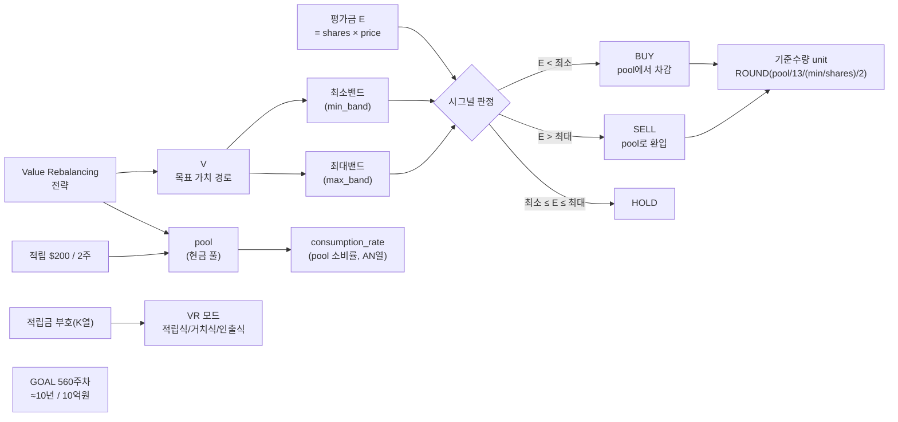
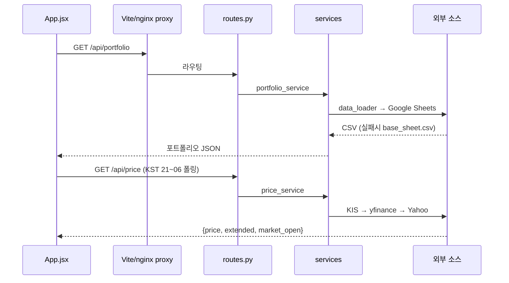
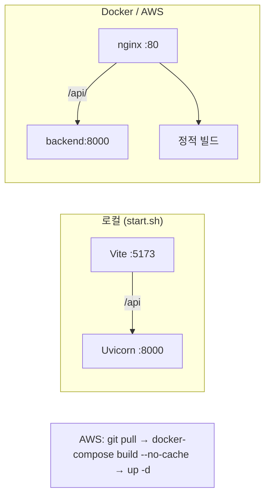

# Trakit 지식 그래프 (Knowledge Graph)

> TQQQ 밸류 리밸런싱 투자 추적 대시보드의 엔티티·관계 지식 그래프.
> 코드 구조, 데이터 흐름, 외부 의존성, 도메인 개념을 노드와 엣지로 표현.
> 생성: 2026-06-03 · 출처: 코드베이스 + CLAUDE.md/CONTEXT.md/README.md/docs

---

## 1. 시스템 아키텍처 그래프

```mermaid
graph TD
    subgraph Client["프론트엔드 (React 18 + Vite 5)"]
        APP["App.jsx<br/>(상태·라우팅 #tqqq/#news)"]
        SIDEBAR[Sidebar]
        HEADER[Header]
        SIGNAL[SignalPanel]
        TRADE[TradeTable]
        PORT[PortfolioCard]
        BAND[BandCard]
        PROG[ProgressCard]
        EQ[EquityChart]
        VL[ValueLineChart]
        PVA[PlanVsActualChart]
        NEWS[NewsPanel]
        KRNEWS[KrNewsPanel]
        KRBAR[KrNightFutureBar]
        GATE[NewsGate]
        APICLIENT["utils/api.js<br/>fetchApi('/api/*')"]
        DEMO["utils/demoData.js<br/>(fallback)"]
    end

    subgraph Proxy["리버스 프록시"]
        VITE["Vite proxy<br/>(로컬, vite.config.js)"]
        NGINX["nginx<br/>(Docker/AWS, nginx.conf)"]
    end

    subgraph Server["백엔드 (FastAPI + Uvicorn :8000)"]
        APPPY["app.py<br/>(진입점·startup)"]
        ROUTES["api/routes.py<br/>(27 엔드포인트)"]
        SCHEMAS["api/schemas.py<br/>(Pydantic)"]
        subgraph Core["core/"]
            DL[data_loader.py]
            MODELS[models.py]
            REBAL[rebalancing_engine.py]
            SIGCALC[signal_calculator.py]
        end
        subgraph Services["services/"]
            PORTSVC[portfolio_service.py]
            PRICESVC[price_service.py]
            TRADECALC[trade_calculator.py]
            BACKTEST[backtesting_service.py]
            FXSVC[exchange_rate_service.py]
            GOALSVC[goal_service.py]
            VISITSVC[visitor_service.py]
            NIGHTSVC[night_future_service.py]
            NEWSAUTH[news_auth_service.py]
            DISCBOT[discord_bot.py]
            DISCSVC[discord_service.py]
        end
        CONFIG["config.py<br/>(SYMBOL, EXCHANGE_MAP…)"]
    end

    subgraph Scripts["backend/scripts/ (배치·크론)"]
        KRSYNC[kr_news_sync.py]
        BCOLLECT[briefing_collector.py]
        BSUM[briefing_summarize.py]
    end

    subgraph External["외부 의존성"]
        GSHEET[(Google Sheets)]
        KIS[(KIS 한국투자증권 API)]
        YF[(yfinance / Yahoo API)]
        FXAPI[(환율 API)]
        SAVETICK[(api.saveticker.com)]
        ESIGNAL[(esignal.co.kr<br/>socket.io)]
        DISCORD[(Discord API)]
        M100[(100m1s.com)]
        GNEWS[(Google News RSS)]
        CLAUDECLI[(Claude CLI)]
    end

    APP --> APICLIENT
    APP -.fallback.-> DEMO
    APP --> SIDEBAR & HEADER & SIGNAL & TRADE & PORT & BAND & PROG & EQ & VL & PVA & NEWS & KRNEWS & KRBAR
    NEWS --> GATE
    APICLIENT --> VITE & NGINX
    VITE --> ROUTES
    NGINX --> ROUTES
    APPPY --> ROUTES
    ROUTES --> SCHEMAS
    ROUTES --> PORTSVC & PRICESVC & TRADECALC & BACKTEST & FXSVC & GOALSVC & VISITSVC & NIGHTSVC & NEWSAUTH & DISCBOT
    PORTSVC --> DL & REBAL & SIGCALC & MODELS
    TRADECALC --> REBAL
    BACKTEST --> REBAL
    DL --> GSHEET
    DL -.fallback.-> CONFIG
    PRICESVC --> KIS & YF
    FXSVC --> FXAPI
    GOALSVC --> DL
    NEWSAUTH --> GSHEET
    NIGHTSVC --> ESIGNAL
    DISCBOT --> DISCORD
    DISCSVC --> DISCORD
    ROUTES -.proxy.-> SAVETICK
    KRSYNC --> M100
    KRSYNC --> KRNEWS
    BCOLLECT --> GNEWS
    BSUM --> CLAUDECLI
    BCOLLECT --> DB[(data/briefing.db<br/>SQLite)]
    BSUM --> DB
```



---

## 2. 도메인 개념 그래프 (밸류 리밸런싱)



**규칙 요약**
- 적립: 2주마다 $200 (`CONTRIBUTION_PER_CYCLE`, `REBALANCE_INTERVAL_WEEKS`)
- 매수 중단: `remaining_pool ≤ initial_pool / 2`
- 매도 횟수 = 매수 횟수
- `week_num`: 문자열("258"), 조정행("204-1"), 미래예측(260~560)
- 가격 색상: 상승 빨강 `#E53935` / 하락 파랑 `#1E88E5` (한국식)

---

## 3. 핵심 엔티티 카탈로그

### 3.1 백엔드 — Core (`backend/core/`)
| 노드 | 책임 | 주요 관계 |
|------|------|-----------|
| `data_loader.py` | Google Sheets/CSV 로딩, 캐시 5일, 컬럼 파싱(pool 콤마, 계획 헤더 위치, executed prices) | → Google Sheets, ← portfolio/goal service |
| `models.py` | 데이터 모델 | ← portfolio_service |
| `rebalancing_engine.py` | 매수/매도 포인트 계산(`calculate_buy_points`/`calculate_sell_points`), 기준수량 | ← trade_calculator, backtesting, portfolio |
| `signal_calculator.py` | BUY/SELL/HOLD 시그널 생성 | ← portfolio_service |

### 3.2 백엔드 — Services (`backend/services/`)
| 노드 | 책임 | 외부/데이터 |
|------|------|-------------|
| `portfolio_service.py` | 포트폴리오 상태·히스토리, executed_prices·consumption_rate·vr_mode 노출 | data_loader |
| `price_service.py` | 실시간 가격 (KIS→yfinance→Yahoo v8→Yahoo quote), 캐시 30초, extended 플래그 | KIS, yfinance, Yahoo |
| `trade_calculator.py` | 매수/매도 tier 테이블 생성 | rebalancing_engine |
| `backtesting_service.py` | 백테스트 | rebalancing_engine |
| `exchange_rate_service.py` | USD/KRW 환율, KST 17시 후 1일 1회 | 환율 API |
| `goal_service.py` | 계획대비·시간차·남은 횟수, "계획"컬럼 헤더 탐색, 560주차 연장 | data_loader |
| `visitor_service.py` | 방문 통계 (오늘/월간/누적) | data/visitors.json |
| `night_future_service.py` | KOSPI200 야간선물 실시간 (socket.io), 18:00~05:00 세션 freeze | esignal.co.kr |
| `news_auth_service.py` | 뉴스 페이지 비밀번호 인증, Sheet AQ1 base64 디코딩, 캐시 5분 | Google Sheets |
| `discord_bot.py` | 슬래시 명령 로직, 세션 라벨(사전장/시간외) | Discord |
| `discord_service.py` | Discord 웹훅/등록 | Discord |

### 3.3 백엔드 — Scripts (`backend/scripts/`, 배치/크론)
| 노드 | 책임 | 파이프라인 |
|------|------|-----------|
| `kr_news_sync.py` | 100m1s.com → `frontend/public/kr-news/` 정적 미러링 (평일 매시 10분 크론) | 100m1s → 정적자산 |
| `kr_data_build.py` | **자체생성** 일봉 — interpreted universe → 키움 ka10081 → `dailybars/{code}.json` | 키움 → dailybars |
| `kr_ranking_capture.py` | **자체생성** 랭킹 — 조건검색 ka10171/172 장중 캡처 누적 → `kiwoom/{date}.json` | 키움 조건검색 → 랭킹 |
| `kr_interpret_build.py` | **자체생성** 뉴스 — 랭킹종목 → 네이버검색 → Gemini(newzy) → `interpreted/stock-{date}.json` | 네이버+Gemini → 해석 |
| `kr_og_build.py` | **자체생성** OG — dailybars → Pillow 1200×630 카드 → `og/news/stock/{date}/{code}.png` | dailybars → OG png |
| `briefing_collector.py` | 나스닥 헤드라인 수집 (Google News RSS), SQLite 중복 방지 (Step 1) | Google News → briefing.db |
| `briefing_summarize.py` | Claude CLI subprocess 로 점수+한국어 요약 (Step 2, API키 불필요) | briefing.db → 요약 |

### 3.4 프론트엔드 (`frontend/src/`)
| 노드 | 책임 |
|------|------|
| `App.jsx` | 상태관리·데이터로딩·주차 네비·해시 라우팅(`#tqqq`/`#news`) |
| `Sidebar` / `Header` | 네비게이션 (기본 접힘 64↔220px), 주차 이동·실시간 가격 |
| `SignalPanel` | 매수가/매도가, 실시간 가격(↻), 세션 라벨 |
| `TradeTable` | 매수/매도 tier, 체결가 취소선 표시 |
| `PortfolioCard`·`BandCard`·`ProgressCard` | 포트폴리오·밴드·목표 진행률(환율 반영) |
| `EquityChart`·`ValueLineChart`·`PlanVsActualChart` | Recharts 차트, `<Brush>` 스크롤, 동적 Y축 |
| `NewsPanel`·`NewsGate` | saveticker 뉴스, 비밀번호 게이트 |
| `KrNewsPanel`·`KrNightFutureBar` | KR 뉴스(미러), KOSPI200 야간선물 라이브바 |
| `utils/api.js`·`format.js`·`demoData.js` | API 클라이언트, 포맷, fallback 데모 |

---

## 4. 데이터 흐름 (주요 경로)



**Fallback 체인 (회복력 패턴)**
- 데이터: Google Sheets → `data/base_sheet.csv`
- 가격: KIS → yfinance → Yahoo v8 → Yahoo quote
- 뉴스: saveticker 라이브 → stale 캐시
- FE 전체: API 실패 → `demoData.js`

---

## 5. API 엔드포인트 ↔ 서비스 매핑

| 엔드포인트 | 서비스 노드 |
|-----------|-------------|
| `/api/portfolio`, `/portfolio/history` | portfolio_service |
| `/api/signals` | signal_calculator |
| `/api/price`, `/price/history`, `/quote`, `/watchlist` | price_service |
| `/api/trade-points`, `/trade-points/calc`, `/trade-points/saved` | trade_calculator + rebalancing_engine |
| `/api/backtest` | backtesting_service |
| `/api/remaining`, `/goal` | goal_service |
| `/api/exchange-rate` | exchange_rate_service |
| `/api/visit`, `/visitors` | visitor_service |
| `/api/news`, `/news/detail/{id}` | (saveticker 프록시) |
| `/api/news/auth` | news_auth_service |
| `/api/kr-night-future` | night_future_service |
| `/api/discord/register`, `/discord/interactions`, `/notify` | discord_service / discord_bot |
| `/api/config`, `/refresh`, `/health` | app/config/data_loader |

---

## 6. 외부 시스템 의존성

| 외부 노드 | 용도 | 인증/비고 |
|-----------|------|-----------|
| Google Sheets (`1dI12c4Aik…`) | 포트폴리오 원천 데이터 + 뉴스 비번(AQ1) | CSV export, UTF-8 강제 |
| KIS 한국투자증권 | 실시간/사전장/시간외 가격, (TODO) 예약주문 | `.env` 앱키, 토큰 `.kis_token.json` 영속, AWS Param Store |
| yfinance / Yahoo API | 가격 fallback | 무인증 HTTP |
| 환율 API | USD/KRW | KST 17시 후 1회 |
| api.saveticker.com | 뉴스 목록/상세 | 서버측 프록시(CORS 회피) |
| esignal.co.kr | KOSPI200 야간선물 | socket.io, 비공식(ToS 주의) |
| Discord | 슬래시 명령·웹훅 알림 | 봇 토큰 |
| 100m1s.com | KR 뉴스 미러 원본 (과도기) | 크론 동기화 |
| **키움 REST** (`api.kiwoom.com`) | KR 자체수집: 일봉(ka10081)·시세(ka10001)·조건검색(ka10171/172) | 모의 appkey, 토큰 `.kiwoom_token.json`, 실전/모의 단일 도메인 |
| **네이버 검색 API** | KR 뉴스 수집(제목+요약+링크) | `NAVER_CLIENT_ID/SECRET`, 일 25,000회 |
| **Gemini API** | 뉴스 해석(newzy 인과사슬·점수) | `GEMINI_API_KEY`(`AQ.`형식), gemini-2.5-flash |
| Google News RSS | 브리핑 헤드라인 | 무인증 |
| Claude CLI | 헤드라인 요약 | 구독 OAuth (API키 불필요) |

---

## 7. 배포 토폴로지



| 환경 | FE | 프록시 | BE | 설정 |
|------|----|--------|----|------|
| 로컬 | :5173 | Vite | :8000 | vite.config.js |
| Docker | :80 | nginx | backend:8000 | nginx.conf |
| AWS | NLB | nginx | backend:8000 | nginx.conf |

---

## 8. 보조 자산 노드

| 노드 | 종류 | 비고 |
|------|------|------|
| `trakit-dashboard.pen` / `pencil/` | 디자인 | Pencil MCP 전용 (Read/Grep 금지) |
| `agents/{backend,frontend,cicd,pencil}.md` | 에이전트 문서 | 영역별 상세 가이드 |
| `docs/api-spec.md` | API 명세 | 엔드포인트 상세 |
| `docs/TODO.md` | 로드맵 | KIS 예약주문 자동화, WebSocket |
| `docs/kr-data-sources.md` | 계획 | KR 데이터 자체수집 토큰/계정 체크리스트 |
| `data/briefing.db` | SQLite | 브리핑 헤드라인+요약 (미커밋) |
| `data/visitors.json` | 상태 | 방문자 통계 |
| `backend/test/test_api.py` | 테스트 | FastAPI TestClient 19개 |

---

## 9. KR 데이터 자체수집 파이프라인 (`#kr-news`, 2026-06-03)

100m1s 미러를 키움+네이버+Gemini 자체수집으로 대체. 100m1s 비공개 `news_pipeline`(대표 PC) 생성기를 **출력물 역설계**로 trakit 에 재현 (스키마·디자인 1:1, 값은 우리 기준).

```mermaid
graph TD
    subgraph Keys["키 (backend/.env, gitignore)"]
        KW[KIWOOM_APP_KEY/SECRET<br/>모의]
        NV[NAVER_CLIENT_ID/SECRET]
        GM[GEMINI_API_KEY<br/>gemini-2.5-flash]
    end
    subgraph Svc["services/"]
        KSVC["kiwoom_service.py<br/>token·ka10081·ka10001<br/>조건검색 ka10171/172"]
        NISVC["kr_news_interpret.py<br/>analyze_news_newzy"]
    end
    subgraph Build["scripts/ 생성기 (서버 cron)"]
        B1["kr_data_build.py<br/>(일봉)"]
        B2["kr_ranking_capture.py<br/>(랭킹·장중 15분)"]
        B3["kr_interpret_build.py<br/>(뉴스 해석)"]
        B4["kr_og_build.py<br/>(OG 이미지)"]
    end
    subgraph Out["frontend/public/kr-news/ (gitignore)"]
        D1[(dailybars/{code}.json)]
        D2[(kiwoom/{date}.json)]
        D3[(interpreted/stock-{date}.json)]
        D4[(og/news/stock/{date}/{code}.png)]
    end
    KIWOOM[(키움 REST<br/>api.kiwoom.com)]
    NAVER[(네이버 검색 API)]
    GEMINI[(Gemini API)]
    YH[(영웅문 조건식<br/>500억이상·클라우드)]

    KW --> KSVC --> KIWOOM
    YH -.조건식 등록.-> KIWOOM
    NV --> NISVC
    GM --> NISVC --> GEMINI
    NISVC --> NAVER

    KSVC --> B1 --> D1
    KSVC --> B2 --> D2
    D2 --> B3
    NISVC --> B3 --> D3
    NAVER --> B3
    D1 --> B4 --> D4
    D2 --> B4
    D1 -. universe/OHLC .-> B3
```

**레이어·생성기·검증 (4 레이어 전부 ✅)**

| 레이어 | 산출물 | 생성기 | 소스 TR/API | 검증 |
|--------|--------|--------|-------------|------|
| 일봉 | `dailybars/{code}.json` | `kr_data_build.py` | ka10081 | 100m1s와 원단위 100% 일치, 풀빌드 456종목 |
| 랭킹 | `kiwoom/{date}.json` | `kr_ranking_capture.py` | ka10171/172(WS) | 조건식 실행 성공, 장중 캡처(소급 불가) |
| 뉴스 | `interpreted/stock-{date}.json` | `kr_interpret_build.py` | 네이버검색+Gemini | newzy 역설계(score=5평균), 체인 검증 |
| OG | `og/.../{code}.png` | `kr_og_build.py` | dailybars+Pillow | 1200×630 카드 원본 대조 |

**핵심 제약**: 조건검색은 실시간 전용(과거 소급 불가, 장중만 충실) · 조건 추가필터·newzy 프롬프트는 비공개(근사) · interpreted 풍부 스키마(themes_tree·togusa·hugepark 등) 미생성.

---

## 10. 진행 중 / 예정 (docs 기반)
- **KIS 예약주문 자동화**: Phase1 개인용 → Phase2 멀티유저(인증·DB·암호화)
- **KR 자체수집 잔여**: 조건 추가필터 정밀화, interpreted 풍부 스키마, 미러→자체 완전 전환
- **WebSocket 실시간 통신** (docs/TODO.md)

---

*이 그래프는 분석 보조용이며, 노드/관계는 코드 변경 시 갱신 필요.*
